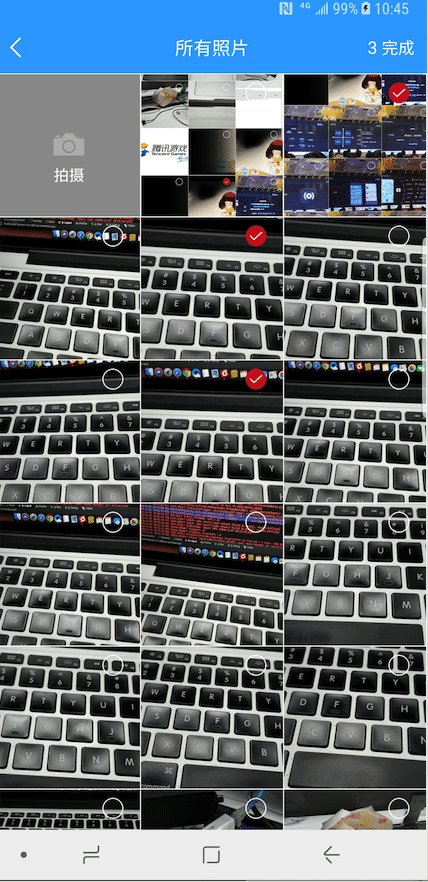

# 图片选择器封装
> 一款封装了图片选择基础功能的组件



## 最新版本
https://bintray.com/miaoyanrssq/maven/mediaselector/_latestVersion

## 使用

```groovy
implementation 'com.zgy.mediaselector:mediaselector:0.0.3'
```

默认配置：
```java
MediaSelector.create(MainActivity.this)
                        .getModel()
                        .forResult(MediaConfig.CHOOSE_REQUEST);
```

完整版：
```java
MediaSelector.create(MainActivity.this)
                        .getModel()
                        .camera(false)//直接拍照，如果为true，则默认单选，直接跳相机，关于选图页面的配置将不起作用，默认false
                        .maxSelectNum(3)//最多选择数量， 默认9
                        .isShowSelectedNum(true)//是否显示已选数量，默认true
                        .canPreview(true)//是否可预览，默认true
                        .openCamera(true)//选图页面是否显示相机入口，默认false
                        .imageSpanCount(3)//gridview显示列数，默认3
                        .isZoomAnim(true)//选择动画是否开启，默认false
                        .compress(true)//是否压缩图片，默认false
                        .synOrAsy(true)//同步or异步压缩，默认同步
                        .minimumCompressSize(100)//最小免压缩大小，单位kb
                        .compressSavePath("")//自定义压缩后输出路径
                        .setOutputCameraPath("")//自定义拍照后输出路径
                        .imageFormat("image/JPEG")//自定义拍照后图片格式
                        .forResult(MediaConfig.CHOOSE_REQUEST);//页面回调，必填
```

回调处理：
```java
@Override
    protected void onActivityResult(int requestCode, int resultCode, @Nullable Intent data) {
        super.onActivityResult(requestCode, resultCode, data);
        if (resultCode == RESULT_OK) {
            switch (requestCode) {
                case MediaConfig.CHOOSE_REQUEST:
                    List<MediaEntity> selectList = MediaSelector.obtainSelectResult(data);//统一处理回调数据
                    for(MediaEntity entity : selectList){
                        Log.e("图片-----》", entity.getPath());
                        if(entity.isCompressed()){
                            Log.e("压缩图片-----》", entity.getCompressPath());
                        }
                    }
                    break;

                default:
                    break;
            }
        }
    }
```